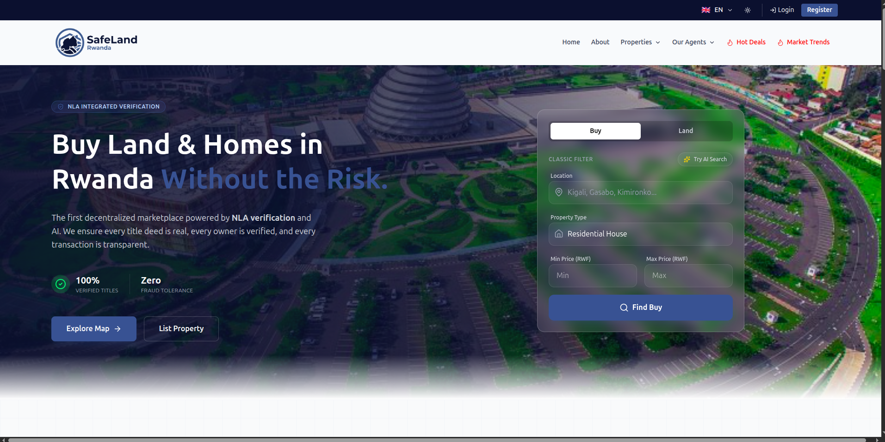
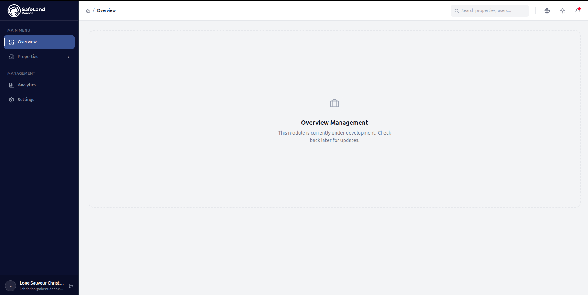

# Safe Land Rwanda

## Description
Safe Land Rwanda is a comprehensive platform for real estate market analysis, property management, and secure land transactions in Rwanda. The project leverages advanced data science (including time-series forecasting with Meta Prophet (CNNS)), a modern React frontend, and robust backend services to empower users with actionable insights and seamless property operations.

## GitHub Repository
[https://github.com/lscblack/Safe_Land_Rwanda](https://github.com/lscblack/Safe_Land_Rwanda)
### Demo
[https://youtu.be/E-LktPudyuU](https://youtu.be/E-LktPudyuU)

## Setup Instructions

### Prerequisites
- Node.js (v16+ recommended)
- Python 3.8+
- pnpm (for frontend)
- pip (for backend and ML)

### 1. Clone the Repository
```
git clone https://github.com/lscblack/Safe_Land_Rwanda.git
cd Safe_Land_Rwanda
```

### 2. Frontend Setup (Vite + React)
```
cd Clients
pnpm install
pnpm run dev
```
- The frontend is deployed on Vercel for production.

### 3. Backend Setup (FastAPI/, Offchain)
```
cd ../offchain
python3 -m venv venv
source venv/bin/activate
pip install -r requirements.txt
python main.py / uvicorn main:app --reload --port 8000
```

### 4. Machine Learning/Analytics (Jupyter, Prophet)
```
cd ../ml/market_trends
pip install -r ../../offchain/requirements.txt
jupyter notebook
```
- Open `test.ipynb` and `MarketTrendAnalysis.ipynb` for time-series forecasting and analytics.

### 5. Onchain (Smart Contracts)
```
cd ../onchain
pip install -r requirements.txt
# For contract deployment:
# truffle migrate --network <network>
uvicorn app.main:app --reload --port 8080
```

## Designs
- **Figma Mockups:** [Figma UI/UX Design](https://www.figma.com/proto/aQExFrnDLYFwrURYwvdzXE/Builder-Figma-to-Code-Plugin-Playground--Copy-?node-id=2517-392&t=taAa4NAiVusyD7Jc-1)
- **Screenshots:**
  - 
  - 

- **Architecture:**
  - 


## Technology Choices & Rationale

This project leverages a modern, robust technology stack for full-featured, scalable, and maintainable real estate analytics and operations. Below are the key tools and frameworks used, and why they were chosen:

### Backend/API
- **FastAPI**: Chosen for its high performance, async support, and automatic OpenAPI documentation. Enables rapid development of secure, scalable REST APIs for property management and analytics.

- **Ganache**: Provides a local Ethereum blockchain for rapid smart contract development and testing, ensuring safe and repeatable onchain operations.

### Frontend
- **React (with TypeScript)**: Enables a highly interactive, component-driven UI with type safety for maintainability and scalability.
- **Vite**: Fast build tool for modern React apps, improving developer experience and build speed.
- **Tailwind CSS**: Utility-first CSS framework for rapid, consistent, and responsive UI design.

### Machine Learning & Analytics
- **Meta Prophet**: State-of-the-art time-series forecasting library from Meta, chosen for its accuracy, interpretability, and ease of use for real estate price prediction.
- **PyTorch**: Used for building and training advanced neural network models (CNN, LSTM, CNN-LSTM) to capture complex patterns in market data, with GPU acceleration.
- **scikit-learn**: For preprocessing, feature engineering, and model evaluation metrics.
- **Jupyter Notebook**: Interactive environment for data exploration, visualization, and iterative model development.

#### Forecasting Model Strategy
- **Prophet**: For interpretable, robust time-series forecasting of land prices.
- **CNN, LSTM, CNN-LSTM (PyTorch)**: Multiple deep learning models are trained (with different parameters and early stopping) to capture both local and sequential patterns in the data. The best model is selected based on performance metrics (MAE, RMSE, R², MAPE).

### Blockchain/Onchain
- **Truffle**: For smart contract compilation, migration, and testing.
- **Ganache**: Local blockchain for safe, fast contract development.

### Other
- **Vercel**: For seamless frontend deployment and CI/CD.
- **Docker** (planned): For containerized backend deployment.

---

## Deployment Plan
- **Frontend:**
  - Deployed on [Private Serverk](http://197.243.23.195) for production. All pushes to `main` auto-deploy.
- **Backend:**
  - Local development with FastAPI. Production deployment (Docker, cloud, or VPS) is planned for the next phase.
- **Onchain:**
  - Smart contracts managed in the `onchain` directory. Deployment scripts provided.
- **ML/Analytics:**
  - Jupyter notebooks for analytics and forecasting. Results can be integrated into the dashboard.
